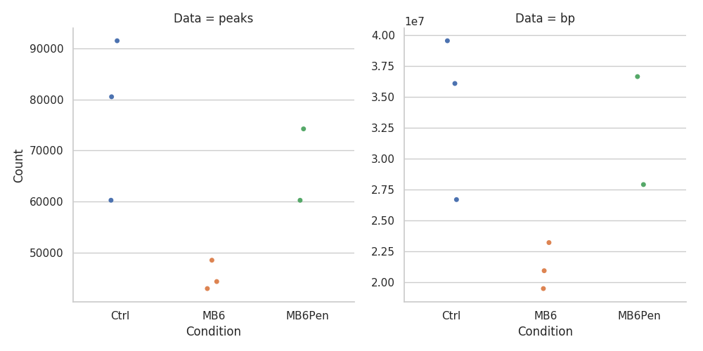

# Summary

This folder contains work relating to the global chromatin accessibility patterns observed in the ATAC-seq data.

## Results

### Peaks and global accessibility

The peak sets called from each sample have approximately the same size distribution, with the median peak length of ~400bp.

The number of peaks, themselves, serves as a proxy for the global accessbility of each sample.

As shown, the MB6 samples have the smallest number of peaks, as well as lowest number of bp in peaks.
Between MB6 and Ctrl, there are 62 possible configurations of these 6 data points ($2^N - 2$) into 2 groups.
The MB6 samples contain the lowest 3 counts, which means 1/62 configurations has a mean/median value as low as this one here.
$\frac{1}{62} \approx 0.01613$, thus, there is a statistically significant difference between the global accessibility of the Ctrl and MB6-treated samples.

### Clustering samples via Jaccard index

By calculating the Jaccard index for each pair of samples, we cluster the samples and display in the heatmap below.

While not all of the Ctrl cluster completely together, the Ctrl and MB6Pen samples do cluster distinctly from the MB6 samples.
There isn't a large separation, based on the Jaccard values, but the separation is there, nonetheless, showing that the MB6 samples do appear to be different from the Ctrl and MB6Pen samples.

## Conclusions

This data suggests that the MB6 samples are consistently different from the MB6Pen and Ctrl samples, and that there is a statistically significant difference in their global chromatin accessibility.